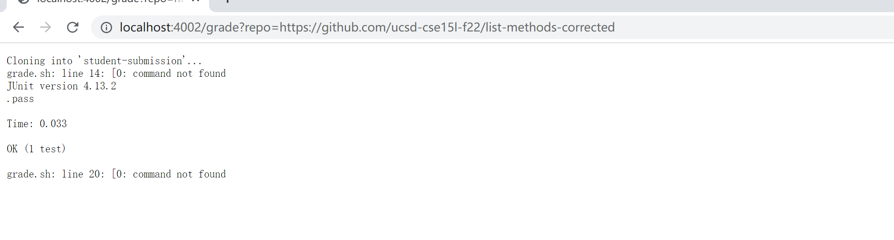

# Lab report 5
```
set -e

rm -rf student-submission
git clone $1 student-submission
if [ -f "./student-submission/ListExamples.java" ]
then
     cp  *.java grade.sh  ./student-submission/
     cp -R lib ./student-submission/
     cd student-submission
     javac -cp ".;lib/hamcrest-core-1.3.jar;lib/junit-4.13.2.jar" *.java
     if [$? ne 0 ]
     then
        echo "ListExamples.java does not compile!"
        exit 1
     else
        java -cp ".;lib/junit-4.13.2.jar;lib/hamcrest-core-1.3.jar" org.junit.runner.JUnitCore TestListExamples
     fi
else
     echo "Wrong file!"
     exit 1
fi
```
## Screenshot 1

## Screenshot 2


## Trace for Screenshot 2 (https://github.com/ucsd-cse15l-f22/list-methods-lab3)

### First
The return code is 0.
The stderr is "fail percent is 50% Filter pass and Merge fail".
### Second
First if statement is true, because the file exist. 
Second if statement is true, because the ListExamples.java is compiled.
### Third
The else for the first if does not run.
```
else
     echo "Wrong file!"
     exit 1
```
The else for the second if does not run.
```
 else
        java -cp ".;lib/junit-4.13.2.jar;lib/hamcrest-core-1.3.jar" org.junit.runner.JUnitCore TestListExamples
```
